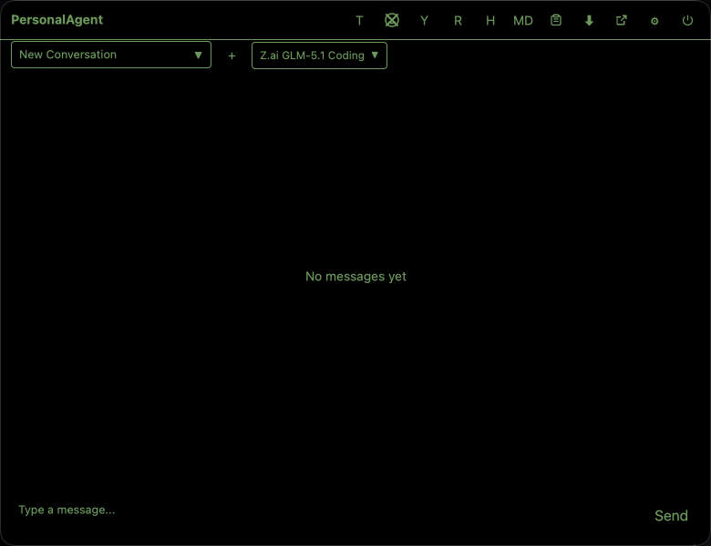

# Personal Agent walkthrough

This walkthrough takes you from installation to your first chat. The example profile uses Z.ai's coding plan with GLM-5.1 because it is a current, sensible OpenAI-compatible model setup.

## 1. Install Personal Agent

### macOS with Homebrew

```bash
brew tap acoliver/homebrew-tap
brew install personal-agent
```

The tap name is `acoliver/homebrew-tap`.

### Other platforms

Download the latest package for your platform from [GitHub Releases](https://github.com/acoliver/personal-agent/releases):

- macOS app bundle
- Windows ZIP
- Linux `.deb`, `.rpm`, or portable ZIP

## 2. Launch the app

Start Personal Agent from your applications launcher or run the installed binary.

- macOS: look for the Personal Agent icon in the menu bar.
- Windows: look in the notification-area system tray.
- Linux: look in the StatusNotifierItem/AppIndicator tray area.

Click the icon to open the chat panel.



The screenshot above was captured from the real running app.

## 3. Open settings

Click the gear icon in the chat panel toolbar. Settings contain the profile list, model configuration, API key management, appearance, MCP tools, and security options.

## 4. Create a model profile

1. In settings, open the **Models** section.
2. Click **+** to add a profile.
3. Give it a clear name, for example `Z.ai GLM-5.1 Coding`.
4. Choose the provider/model from the registry if available. If you configure it manually, use the values below.

Example Z.ai coding-plan profile:

| Field | Value |
| --- | --- |
| Profile name | `Z.ai GLM-5.1 Coding` |
| Provider | `z-ai` or a custom OpenAI-compatible provider entry for Z.ai |
| Model | `glm-5.1` |
| Base URL | `https://api.z.ai/api/paas/v4` |
| API key label | `z-ai` |
| Temperature | `0.7` |
| Max tokens | `4096` |

If the UI presents a model picker, prefer selecting the Z.ai GLM-5.1 model from the registry instead of typing provider details by hand. Manual fields are useful when the registry has not yet been refreshed.

## 5. Add the API key

1. In the profile editor, select keychain/API-key authentication.
2. Enter a label such as `z-ai`.
3. Paste your Z.ai API key.
4. Save the key and profile.

Personal Agent stores secret values in your OS credential store:

- macOS: Keychain Services
- Windows: Credential Manager
- Linux: Secret Service, such as GNOME Keyring or KDE Wallet

Profile files reference the key label; they should not contain the API key itself.

## 6. Select the profile

Return to the chat panel and select `Z.ai GLM-5.1 Coding` from the profile dropdown. If it does not appear, reopen settings and verify that the profile was saved.

## 7. Send your first message

Click the input field, type a message, and press Enter or click **Send**.

Try a small coding prompt first, for example:

```text
Write a Rust function that returns true when a string is a palindrome. Include a short explanation.
```

Responses stream into the chat panel as the model generates them. Conversation history is saved automatically.

## Troubleshooting

### I do not see the tray icon

- macOS: check the menu bar near the clock and control icons.
- Windows: expand the notification area overflow menu.
- Linux: confirm your desktop supports StatusNotifierItem/AppIndicator. GNOME often needs an AppIndicator extension.

### The profile dropdown is empty

Open settings, go to **Models**, and create a profile. Save it, then return to chat. If needed, restart the app.

### The model call fails with an authentication error

Reopen the profile and confirm:

- The API key label matches the saved key.
- The API key is valid for your Z.ai account/plan.
- The provider is configured as OpenAI-compatible if using manual setup.
- The base URL is correct.

### The model is missing from the picker

Use **Refresh Models** in settings. If it still does not appear, configure the profile manually with the Z.ai GLM-5.1 values above.

### Linux packages install but no window opens

Make sure your desktop session has tray support and the required system libraries. On GNOME, enable an AppIndicator/SNI extension.

## Configuration locations

- macOS profiles: `~/Library/Application Support/PersonalAgent/profiles/`
- Windows profiles: `%LOCALAPPDATA%\PersonalAgent\profiles\`
- Linux profiles: `${XDG_CONFIG_HOME:-~/.config}/PersonalAgent/profiles/`

Application data, conversation history, and backups live under the platform data directory for Personal Agent.
